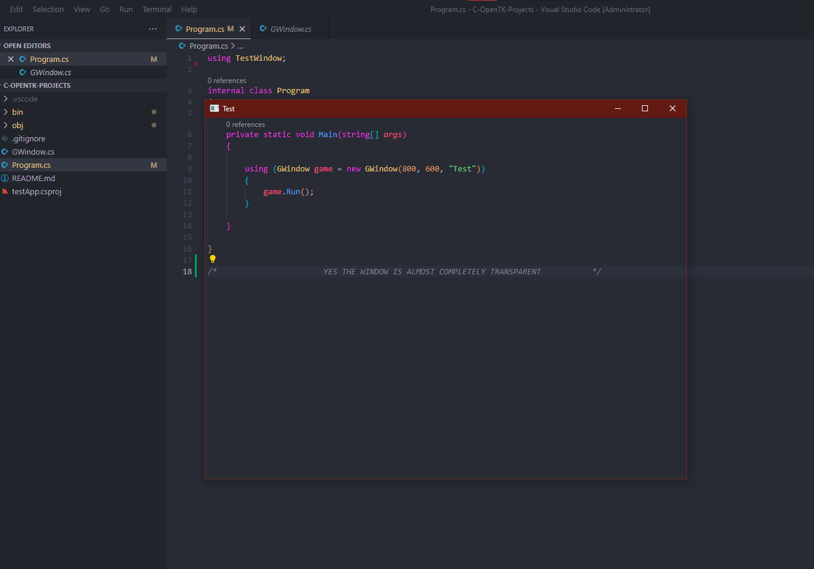
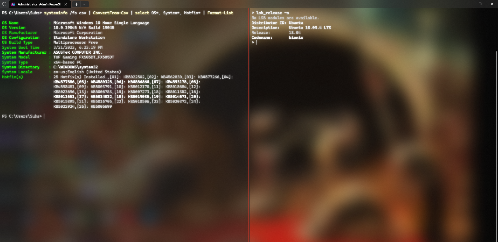
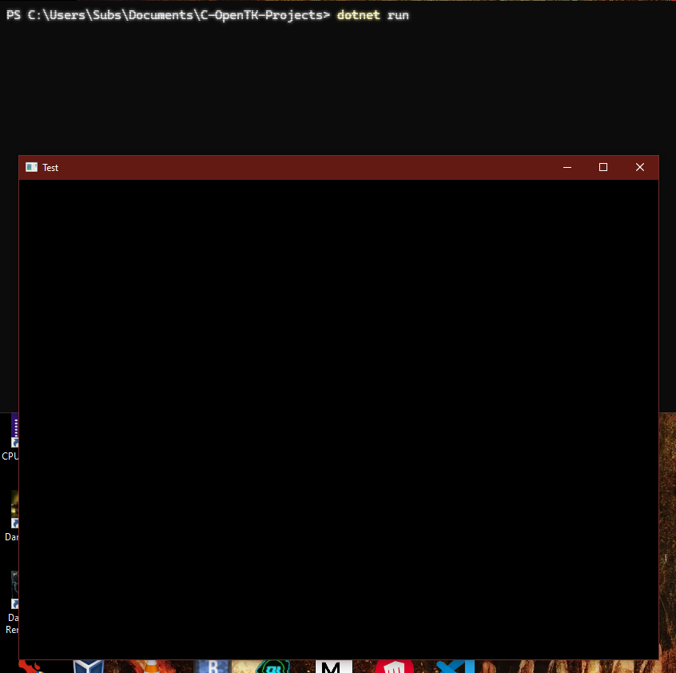
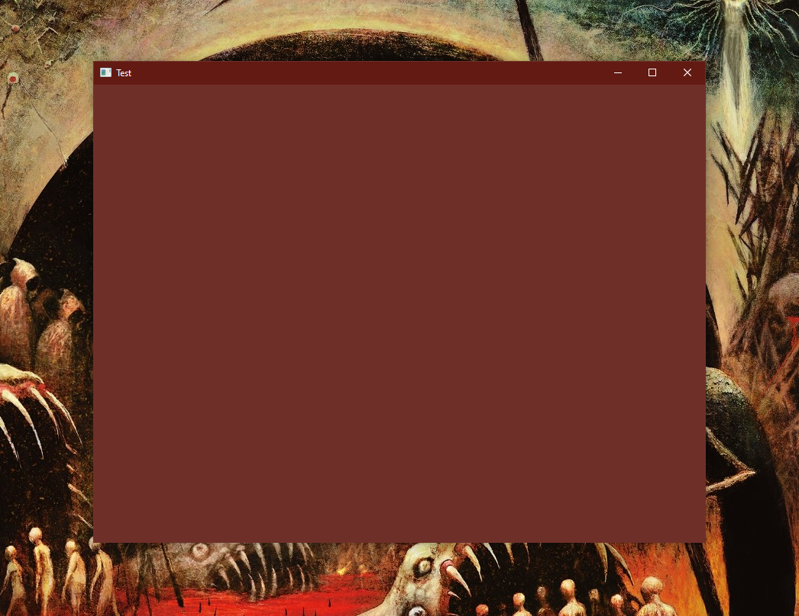

# <!--fit--> Modern WINApi 
#### (Or, how to die inside but succeed anyway)

---
<style scoped>{font-size: 37px}</style>
# Who would want this and why?

* You use Windows (go away linux users)
* You like coding
* You like graphics
* You like to do fun things with UI
* You've used too much JS and want something to bleach your eyes from that monstrosity of a language (Just look at this nonsense)
```javascript
800 == 000800 //True
123 == 000123 //False ???????????
```

---

# Ok but what is this?

* A tutorial on how to use Winapi (A very very old framework used by Windows for all their local in-house applications and their OS) the modern way
* By modern, I mean C#, with .NET, which is incredibly easy and satisfying to use
* C#, for the uninitiated, is basically better C++ with much more class usage (but not the obnoxious Java way)

---

# How this came about

* I was fooling around with OpenTK, which is basically OpenGL for C#, and I wanted to try and make a transparent window, making me inevitably fall into a Winapi rabbit hole culminating in this beauty: (Next slide)

---


(Yes the window is transparent)

---

# How did I do this?

* Unfortunately it was a surprisingly painful journy into the bowels of windows documentation, which was incredibly unhelpful most of the time
* To save everyone else from the pain is my purpose for this presentation (also to show off my cool transparent window)

---
<!--_color: lightgreen-->
# Step 1:
## Accquire C# 
(Or, Escape from Javascript)

---

* Create a new directory for this project. Call it whatever you want
* Install .NET from [this helpful site](https://dotnet.microsoft.com/en-us/download).
* I reccommend you use a Windows Terminal + Powershell 7 for compiling and running because Windows Terminal is the [Second Coming of Christ](https://dotnet.microsoft.com/en-us/download).
* I really really like the quake mode feature and also everything else about this terminal it's wonderful. Use the preview versions, especially Powershell 7, which has autocomplete in its preview

---


(Supports acrylic transparency and 
Windows subsystem for Linux :muscle:)

---

Run `dotnet new console`. This will create a new default C# project with hello world in it.
Test it out with `dotnet run` (which will autobuild the project too, neat)
Told you .NET is pretty sweet

At this point I would reccomend you look up some very basic C# code, or at least some OOP (you'll need it for interviews anyway)

---

<!--_color: lightgreen-->
# Step 2:
## Accquire OpenTK 
(Or, OpenGL is crazy cool)

---

[OpenTK](https://opentk.net) is a package for .NET that allows you to program OpenGL code in C#, something normally done in C++.
If you don't know what OpenGL is, it is a very vast, deep and highly functional library of code that enables you to interact with your computer's GPU 

To draw like a circle on your screen

<sup style=font-size:20px;>(But seriously OpenGL is amazing, you can render ridiculous stuff with it, games or indeed any 3D VFX would not be possible without a library like this)</sup>

---

* Get OpenTK by running the following:
```pwsh
dotnet add package OpenTK --version 4.7.7
```
This should automatically add it to your project.
* If you remember, C# is a class-based language so everything is stuffed into classes. This is actually pretty nice in the case of OpenGL which heavily utilizes weird objects everywhere, which bloats code in C++ but not in C#.

---

Add the following imports to a new C# file (call it whatever you like, but it's going to handle your graphics window):
```cs
using OpenTK.Graphics.OpenGL4;
using OpenTK.Windowing.Common;
using OpenTK.Windowing.Desktop;
using OpenTK.Windowing.GraphicsLibraryFramework;
```
---

Now create any namespace (I called mine TestWindow) and its public class (named after your file). Extend the OpenTK class GameWindow to this class, and add the following:

```cs
public <Your Filename Here>(int width, int height, string title) : 
base(GameWindowSettings.Default, new NativeWindowSettings()
        {
            Size = (width, height),
            Title = title
        }
        ){}
```

Basically this calls the GameWindow class's constructor with our own class's constructor (Learn OOP you lazy people)

---
<style scoped>{font-size: 33px}</style>
This is what your code should look like:

```cs
using OpenTK.Graphics.OpenGL4;
using OpenTK.Windowing.Common;
using OpenTK.Windowing.Desktop;
using OpenTK.Windowing.GraphicsLibraryFramework;

namespace GWindow
{
    public class GWindow : GameWindow
    {
        public GWindow(int width, int height, string title) : 
        base(GameWindowSettings.Default, new NativeWindowSettings()
        {
            Size = (width, height),
            Title = title
        }
        ){}
    }
}

```

(BTW this is all literally in the basic OpenTK tutorial [here](https://opentk.net/learn/chapter1/1-creating-a-window.html?tabs=baseclass-opentk3%2Cgamewindow-ctor-opentk3%2Cgamewindow-run-opentk3%2Ckeypress-opentk3))

---

Now, in your main `Program.cs` file, add `using TestWindow` to your includes and simply add:

```cs
using (GWindow game = new GWindow(800, 600, "Test"))
        {
            game.Run();
        }
```
(You could like add a `private static void main` class function and other fuzz to it but it's not really necessary for some reason)

---

Now run this project using `dotnet run`.
Yay!

(Hopefully it worked at this point, but remember, google is your best friend)

Now follow the rest of that tutorial I linked, adding `OnLoad()`, `OnRenderFrame()` and `OnUpdateFrame()` to your Window class.

---


(You should have something like this)

---

<!--_color: lightgreen-->
# Step 3:
## Make the Window Transparent 

---

* Check OpenGL documentation for 'Transparent Screen'
* Realise there is no such documentation
* Google 'OpenGL transparent window'
* Open a StackOverflow article
* See a ridiculously insane block of code written in C
* See a guy say "The few individuals who have managed to do this have had different approaches"

---

<!--_color: red-->
# Step 4:
## Cry 

---

<!--_color: red-->
# Step 5:
## Windows API
(Or, welcome to OS hell)

---

* This would not be nearly as hard as it was to figure out if all the relevant functions were not ancient, because all the documentation for these functions are written for C++ compatibility.
* These libraries use terrifying `.h` files and involve some alien things like 'compiling' and 'linking' and 'no garbage collection'
* We need to figure out a way to use these functions in C#

---

### First of all, is it even possible?
- Turns out, yes! apparently .NET is backwards compatible with these archaic libraries
- However, using them is not well documented at all. [This document](https://learn.microsoft.com/en-us/dotnet/framework/interop/passing-structures) was the closest I came to getting firsthand information about this. The rest was frantic googling for about 8 hours :skull:

---

To save everyone the headache, the answer lies in a directive called `DllImport`.
* Essentially, this allows you to import any dll from your Windows OS as long as it is available. You can see these dlls in `C:Windows/SysWOW64` or `C:Windows/System32`.
* These dlls function just like those spooky `.h` files.

---

After some quick googling ('Window manager api winapi') I found what I was looking for: `wdmapi.h`, which is present as `wdmapi.dll` in our systems. It has the function `DwmEnableBlurBehindWindow`, which should allow us to at least reach partway to transparency.

---

This is what [DwmEnableBlurBehindWindow](https://learn.microsoft.com/en-us/windows/win32/api/dwmapi/nf-dwmapi-dwmenableblurbehindwindow) has to say about itself:
```
Enable blur by setting the fEnable member of the DWM_BLURBEHIND structure to
TRUE. This results in subsequent compositions of the window blurring the
content behind it. This function should be called immediately before a
BeginPaint call to ensure prompt application of the effect.
```
This is a load of nonsense to say 'Blur the window based on some properties. Apply this before you start drawing your screen.'

Great. Let's look at the function now-

---

<!--_color: red-->
# Step 6:
:skull::skull::skull::skull::skull:
```cpp
HRESULT DwmEnableBlurBehindWindow(
  HWND                 hWnd,
  const DWM_BLURBEHIND *pBlurBehind
);
```
:skull::skull::skull::skull::skull:

(Or, Literally 1984)

---

* Obviously, I flipped, cried some more, and then googled what to do in this situation.
* I found [this again](https://learn.microsoft.com/en-us/dotnet/framework/interop/passing-structures) (Callback!) and saw there's no other way but to convert this function to C# to execute it.
* So here's the jist of it:

---

We are going to need to do something along the lines of this:
```cs
[DllImport("dwmapi.dll")]
static extern <return_type> This_function(<parameters>);

protected override void OnLoad()
{
    //Call it later to make window background transparent
    This_function(params);

    //Follow the OpenTK tutorial to understand this
    //Basically makes the background color transparent
    //(Notice the 0.0f Alpha value)
    GL.ClearColor(0.0f,0.0f,0.0f,0.0f);
}
```
The problem is, we have no clue how to do that.

---

* I didn't either, until I stumbled onto [this random website](https://www.codeproject.com/Articles/9714/Win32-API-C-to-NET) which contains a list of C++ types and their conversion to C#. This was the point where I finally understood how to do this.
* Of course, I didn't know if it would work at all in the first place, and I did have several false starts

---

Anyway, we can use that list to deduce the correct code:
```cs
using System.Runtime.InteropServices;
// Add this to your includes btw

//The structure which our function requires a reference of
[StructLayout(LayoutKind.Sequential)]   //I have no clue what this is but whatever
public struct _DWM_BLURBEHIND
{
    public uint dwFlags;
    public bool fEnable;
    public IntPtr hRgnBlur;
    public bool fTransitionOnMaximized;
}

[DllImport("dwmapi.dll")]
static extern int DwmEnableBlurBehindWindow(IntPtr hWnd,ref _DWM_BLURBEHIND pBlurBehind);

//This function is what we will use to get the hWnd variable in the above function
[DllImport("user32.dll")]
static extern IntPtr GetActiveWindow();


```

---

IMPORTANT NOTE:
If you ever see a library named `win<something>.h`, search for `<something>32.dll` in your system instead. This literally cost me 1 hour of my life to fix :skull:

---

Finally, we can write the following code to render our entire window as blurred:
```cs
_DWM_BLURBEHIND bb;     //Initialize the struct
//DWM_BB_ENABLE + DWM_BB_BLURREGION flags, check the docs regarding this struct
bb.dwFlags = 0x00000001 | 0x00000002;
//Enable the blur
bb.fEnable = true;
//Select blur region as Null to make the entire window blurry
bb.hRgnBlur = IntPtr.Zero;
//This is useless so leave it as false
bb.fTransitionOnMaximized = false;

//This get our currently open OpenGL window
IntPtr hWnd = GetActiveWindow();
//Finally, activate the blur
DwmEnableBlurBehindWindow(hWnd,ref bb);

GL.ClearColor(0.0f,0.0f,0.0f,0.0f);
```

---


(Blurry window?)

---

* So what went wrong?
* It didn't, actually. I tried this in Windows 11 which has transparent-ish tabs by default, and it was quite transparent. Similarly, this would work well in Windows 7.
* Win 10 has solid tabs. (In my case it is red). When you enable this function, it just steals the tab's properties and slaps it onto your window entirely.
* So, all is lost? Not quite, because

---

<!--_color: purple-->
# Step 7:
## Filthy Hacking Time
(Or, Workarounds that actually work)

---

* There's actually a really insane way of making the window fully transparent -
It's by breaking the blur function.
* Remember how we set the blur region to `IntPtr.Zero`, making it Null and applying blur to the entire window? Turns out, if you provide an Invalid region instead, Windows just gives up and doesn't render anything at all in the window.
In other words, transparent!

---

So naturally, I looked for a function that creates a Region, so I can generate an invalid one. I found it in `wingdi.h`, called `CreateRectRgn`.
```cs
[DllImport("gdi32.dll")]
static extern IntPtr CreateRectRgn(int x1, int y1, int x2, int y2);
```
The idea is to initialize `hRgnBlur` with
```cs
    CreateRectRgn(0,0,-1,-1)
```
Which is obviously a wrong rectangle, sides can't be negative length dummy\
This should break the function.

---


And indeed, it does!
(Yes I just reused the same image from the beginning)

---
<style scoped>{font-size: 37px}</style>
So, finally, we have successfully made a transparent window! The only things left to do (in your own time) are:
* Render like something on the screen, like a triangle, following the OpenTK tutorials. There might be some adjustments to be made, for example, by using the `GL.Blend()` function.
* Try to abuse the winapis further. Make like multiple windows or something. Make them automatically move around. There's probably some way to do that.
* I'm sure some cool applications can be made to use this as a feature. The world is your oyster.

---
<style scoped>{font-size: 37px}</style>
# Acknowledgments:
* Firstly, Professor T. Ray from the CS department has been a massive influence on me and my now-lifelong passion for computer graphics. Thank you.
* Windows Terminal. Seriously. It's magnificent. Don't let anybody tell you Windows is bad for coding.
* Google is the only reason we can do anything in this world, truly one of the engines of all time.
* My friends, who by listening to me ramble and complain about insignificant bugs in my code are unwittingly fueling my escapdes further. This is all your fault.

---

# <!--fit--> THANK YOU
I made this presentation in [Marp](https://marp.app), which is great, check it out